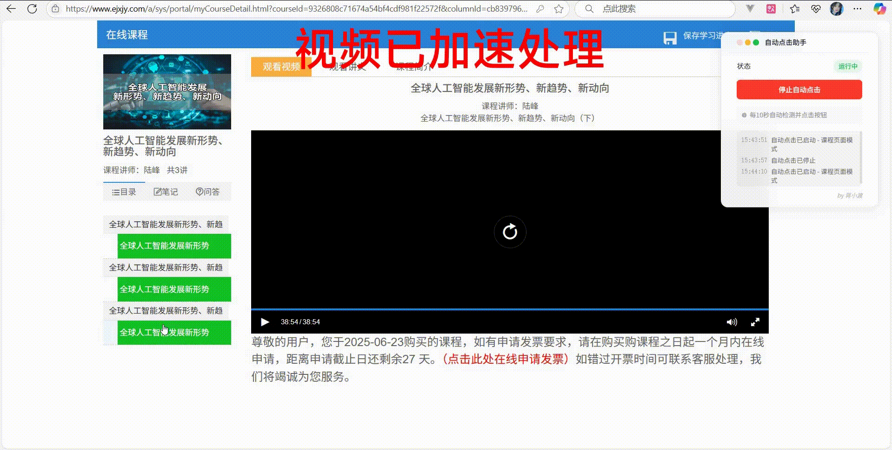
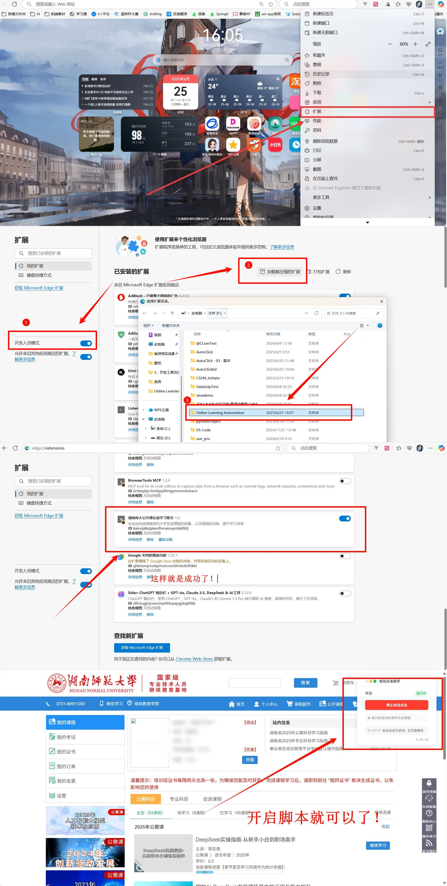

# 🎯 湖南师大公共课在线学习助手 (Online Learning Automation)

一个智能的浏览器扩展，专门为湖南师范大学教师公共课设计，实现课程自动化学习和进度管理。

## ✨ 主要功能

- 🤖 智能模式切换
  - 自动识别主页面和课程页面
  - 根据页面类型执行相应操作

- 📚 主页面功能
  - 自动检测未完成课程
  - 显示课程进度百分比
  - 智能点击"继续学习"按钮
  - 自动跳转到课程学习页面

- 📖 课程页面功能
  - 自动检测章节完成弹窗
  - 自动点击"下一节"按钮
  - 检测课程完成状态
  - 课程完成后自动返回主页

- 🎨 界面特性
  - 美观的悬浮窗口界面
  - 实时状态显示
  - 详细的操作日志（最近3条）
  - 支持拖拽移动位置
  - 支持最小化操作

## 🚀 安装方法

1. 下载本扩展的源代码
2. 打开 Chrome 浏览器，进入扩展管理页面
3. 开启右上角的"开发者模式"
4. 点击"加载已解压的扩展程序"
5. 选择本扩展的文件夹

## 💡 使用说明

1. 安装完成后，进入学习平台 (`https://www.ejxjy.com/`)
2. 在页面右上角会出现悬浮窗口
3. 点击"开启自动点击"按钮启动自动学习
4. 系统会自动：
   - 在主页面检测未完成课程并进入学习
   - 在课程页面自动处理章节完成和课程完成
5. 通过日志窗口实时查看执行状态
6. 需要停止时，点击"停止自动点击"按钮

## 🛠️ 技术特性

- 使用 Chrome Extension Manifest V3
- 纯原生 JavaScript 实现
- 智能的页面状态检测
- 优雅的 UI 设计
- 实时日志反馈
- 低资源占用

## 🎨 界面功能

- 运行状态实时显示
- 一键开关控制
- 实时操作日志展示
- 窗口拖拽功能
- 最小化/关闭功能

## ⚠️ 注意事项

- 仅支持 Chrome 浏览器
- 仅在 `www.ejxjy.com` 域名下运行
- 每10秒进行一次自动检测
- 请合理使用，遵守相关规定

## 👨‍💻 作者

蒋小渡

## 许可证

MIT License 